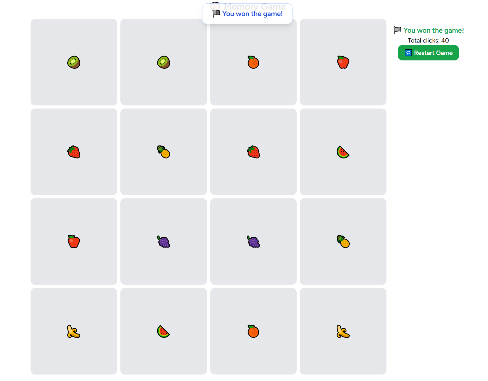

# 🧠 Memory Game (Laravel + Vue + Inertia)

A simple memory matching card game built with Laravel, Vue 3, and Inertia.js.

## 🚀 Features

- User authentication (registration, login, logout)
- Randomized card grid
- Flip and match card logic
- Basic game loop
- Score tracking and saving results
- Coming soon:
  - Player rankings and leaderboard
  - User profiles and stats

---

## ⚙️ Installation

```bash
git clone https://github.com/i3roxon/memory-game.git
cd memory-game
composer install
cp .env.example .env
php artisan key:generate
npm install
npm run dev
php artisan migrate
```

## 🖼️ Screenshot

